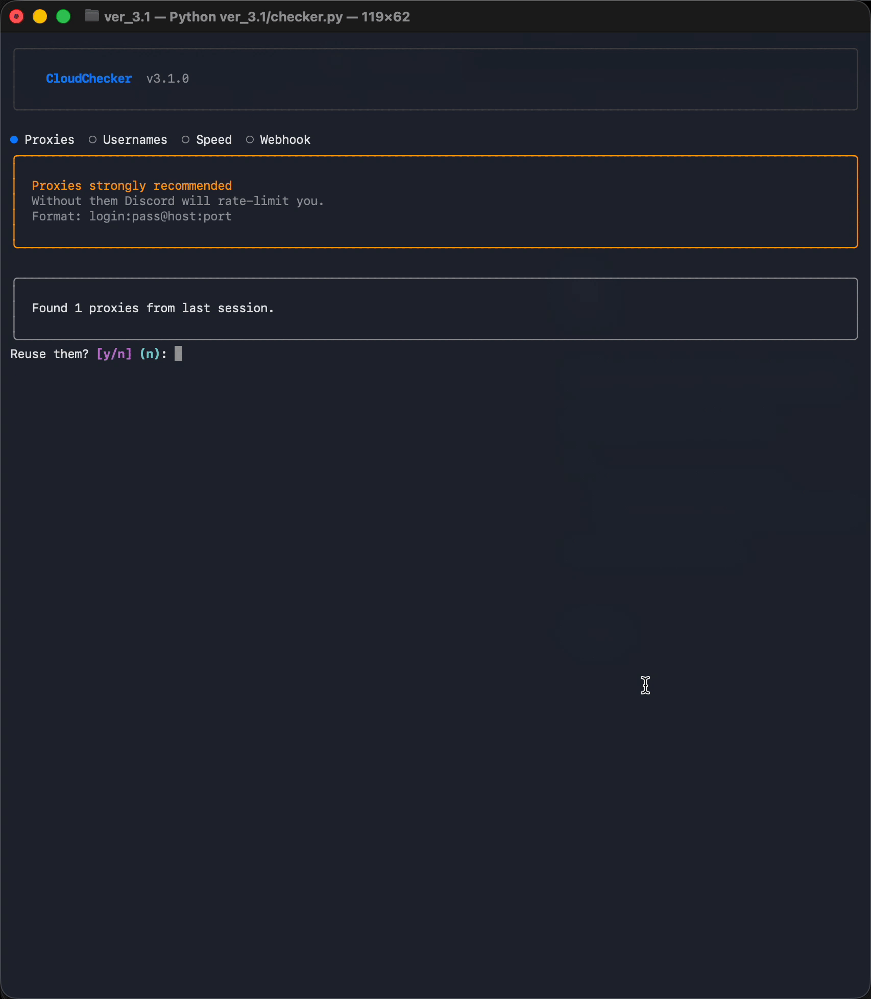

# ☁️ CloudChecker v3.1

<p align="center">
  
  
  
  
</p>

<p align="center">
  <b>Tokenless Discord username checker. Async. Fast. Beautiful.</b><br>
  <sub><a href="https://guns.lol/cloudzik1337">guns.lol/cloudzik1337</a></sub>
</p>

---

## ✨ What is this?

CloudChecker blasts Discord's username availability API at maximum speed using async I/O, rotating proxies, and a `rich`-powered terminal UI. **No Discord token needed.**

**v3.1** refines the full v3 rewrite — gone is the janky thread-spaghetti. In its place: `aiohttp` async concurrency, `rich`-powered CLI, guided wizard, circuit breaker, and a live streaming dashboard.



---

## 🚀 Quick Start

### Prerequisites

Install **Python 3.9+** — [python.org/downloads](https://python.org/downloads)

> ⚠️ On Windows: check **"Add Python to PATH"** during installation.

Verify it's installed:
```bash
python --version
```

### Setup

```bash
git clone https://github.com/Cloudzik1337/DiscordUsernameChecker.git
cd DiscordUsernameChecker

# Create virtual environment
python3 -m venv .venv          # macOS / Linux
python -m venv .venv           # Windows

# Activate it
source .venv/bin/activate      # macOS / Linux
.venv\Scripts\activate         # Windows

# Install dependencies
pip install aiohttp rich

# Run
python checker.py
```

Or: `./run.sh` (macOS/Linux only) — the wizard handles everything.

---

## 🖥️ Live Dashboard

```
┌─ CloudChecker · 1247/5000 (25%) · 18s ────────────────────────────┐
│                                                                    │
│  Available   42          Taken        1205                         │
│  Req/s       823         Requests     9641                         │
│  Progress    1247/5000   Elapsed      18s                          │
│  Proxies     48 alive    Workers      active                       │
│                                                                    │
│  Recent  cloud  zen  f9  xo  aero                                  │
│  ✓ cloud  ✗ zen  ✗ f9  ✓ xo  ✓ aero  ✗ pixel  ✗ blaze  ✗ frost  │
│                                                                    │
└────────────────────────────────────────────────────────────────────┘
```

Clean, real-time. No noise — just what matters.

---

## 🔧 The Wizard

```
 Step 1  ● Proxies   — file, paste, or FREE scrape (3 APIs, dedup)
 Step 2  ○ Usernames — (f)ile or (g)enerate, just press a key
 Step 3  ○ Speed     — concurrency + timeout
 Step 4  ○ Webhook   — optional Discord notifications
```

Run with `--no-wizard` next time to skip straight to checking.

---

## 🌐 Proxy Modes

| Mode            | Speed                | Setup              | Best for          |
|-----------------|----------------------|--------------------|-------------------|
| 🟢 Your proxies | 500–1000+ RPS        | file or paste      | Max performance   |
| 🟡 Free scrape  | 200–500 RPS          | one `y` press      | Quick testing     |
| 🔴 Proxyless    | ~1 RPS               | automatic fallback | No proxies        |

> 💡 50,000 checks ≈ 25 MB. A 1 GB plan handles 40 full runs.

Free sources: proxyscrape.com · geonode.com · openproxylist.xyz — auto-dedup, auto-test, auto-rotate.

---

## 📈 v1 vs v3.1

| Feature                | v1 (old.py)          | v3.1                                     |
|------------------------|----------------------|------------------------------------------|
| HTTP engine            | requests + threads   | aiohttp async (5–10× faster)             |
| UI                     | raw ANSI + input()   | rich — live tables, panels, prompts      |
| Free proxies           | no                   | 3-source scraper + dedup + auto-test     |
| Proxy rotation         | basic cycle          | per-proxy cooldowns, 2-strike dead track |
| Rate-limit handling    | recursion 💀         | circuit breaker + backoff                |
| RPS (good proxies)     | 200–400              | **500–1000+**                            |
| Username generator     | no                   | random, 3L, 4L, word patterns            |
| Setup                  | config editing       | interactive wizard                       |
| macOS                  | broken ❌            | fully tested ✅                          |

---

## ⚡ Why async?

```
requests + threads  →  50 OS threads, GIL contention, ~300 RPS
aiohttp + asyncio    →  1 event loop, zero GIL, ~800+ RPS
```

Every millisecond saved = thousands more checks per minute.

---

## 📁 Project Structure

```
checker.py       entry point & runner
config.py        settings, Stats, JSON config
wizard.py        interactive 4-step setup
proxy.py         proxy manager, scraping, rotation
engine.py        HTTP checker, circuit breaker, webhooks
ui.py            rich-powered live dashboard
run.sh           one-command launcher
```

---

## 🙏 Credits

- **Author** — [cloudzik1337](https://guns.lol/cloudzik1337)
- **~2000 lines** of async, rich, and proxy magic
- **Original** — `old/v1_threaded/old.py` (RIP you beautiful disaster)

<sub>made with DeepSeek</sub>
